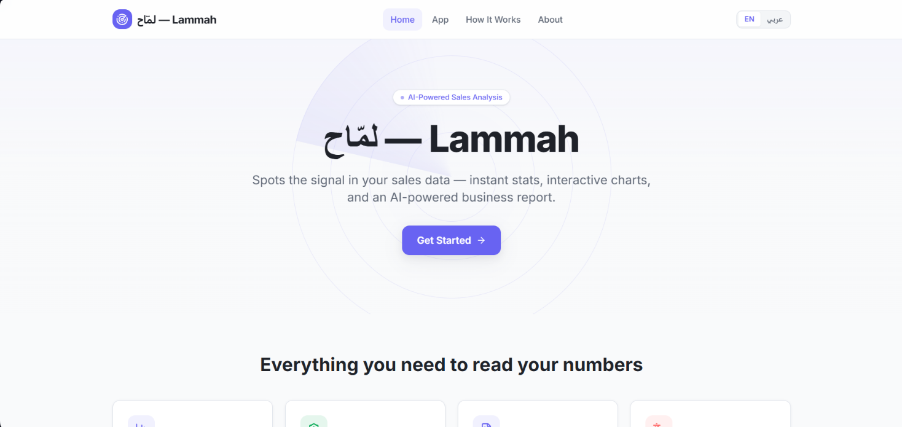
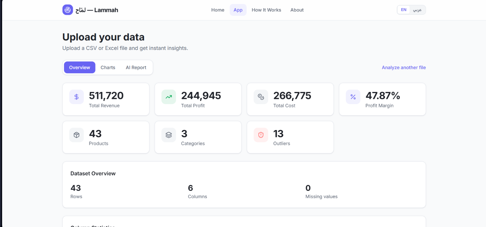
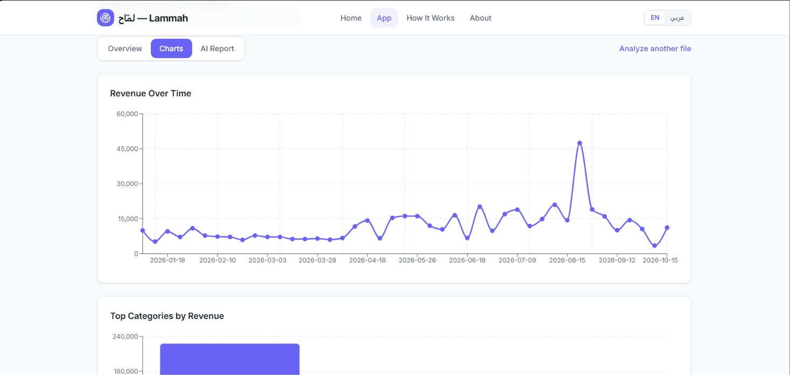
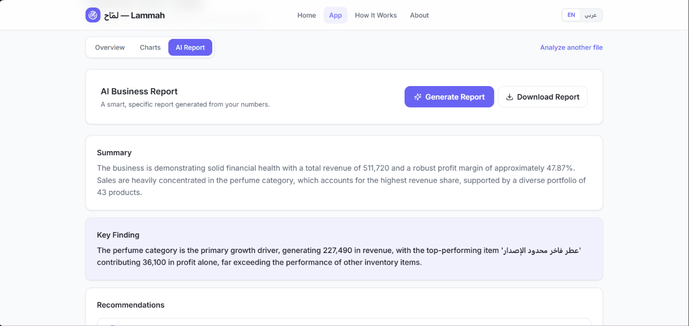

# 📊 Lammah

**AI-Powered Sales Data Analysis Platform for Small Businesses**

---

## 🎯 The Problem

Many small business owners have valuable sales data, but they struggle to:

- Read and analyze their data.
- Use complex and expensive analytics tools.
- Make data-driven decisions instead of relying on guesswork.

---

## 💡 The Solution

**Lammah** analyzes Excel and CSV files and transforms sales data into clear, actionable insights.

### ✨ Features

- **Instant Statistics**
  - Total products
  - Total revenue
  - Net profit
  - Highest and lowest profit
  - Outlier detection

- **Interactive Charts**
  - Time-series trends
  - Category analysis
  - Data distribution

- **Smart AI Report**
  - 3 specific and actionable recommendations
  - Recommendations based on actual data from the uploaded file
  - Suggested actions and expected impact on profitability

---

## 🏆 Project Context

Lammah was built during the **Kanz AI Hackathon 2026**, a 7-day remote AI hackathon with participants from different countries.

🥇 **The project received the Gold Certificate from the judging panel in recognition of its implementation quality and innovative approach.**

### Organized By

- Ministry of Human Resources and Social Development — Saudi Arabia
- Kanz

---

## 🖼️ Project Screenshots

### Homepage

### Results Page

### Interactive Charts

### AI-Powered Report

---

## 🛠️ How We Built It

Lammah was built using **Base44**, an AI-powered development platform.

### 👥 Team Role

- Problem and target audience identification
- Prompt engineering
- UX design and user flow
- Testing and copy refinement
- Project management

### 💻 Technologies

- **React**
- **Tailwind CSS**
- **SheetJS (xlsx)** — Excel file processing
- **Recharts** — Interactive data visualization
- **Base44 LLM** — AI-powered report generation

---

## 👥 Team

- **Azhar Alrashidi**
- **Ghala Alzaydani**

---

## 🔗 Live Project

https://lammah-data-pulse.base44.app

---

## 📄 License

MIT License
